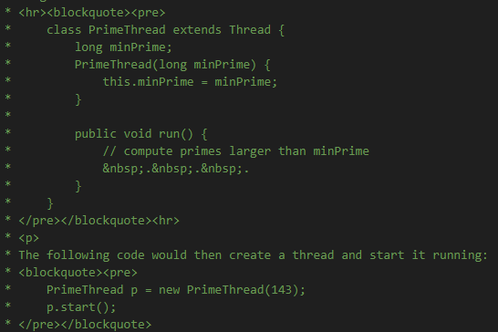
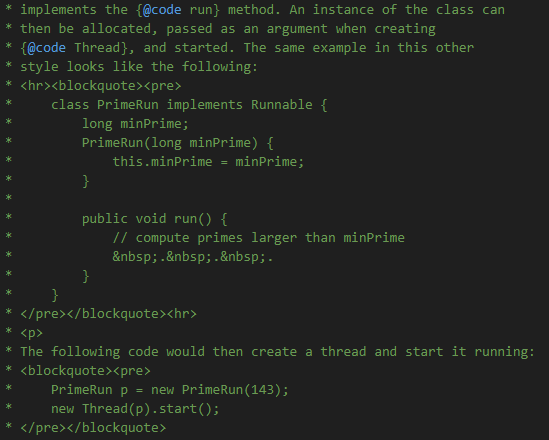
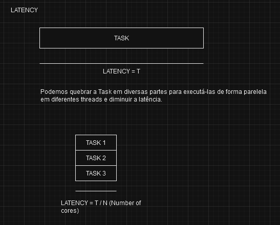
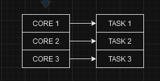
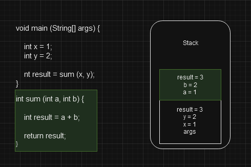
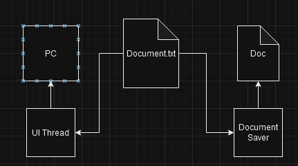
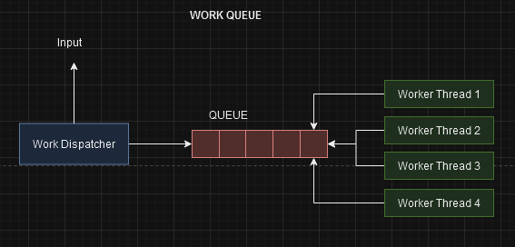
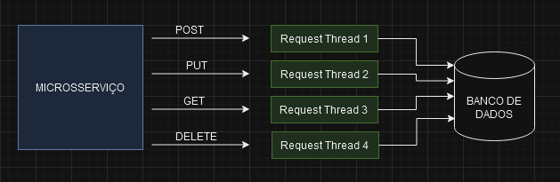
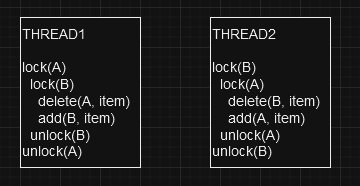
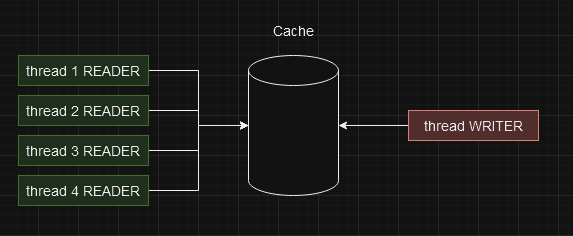

# SECTION 2 - THREAD CREATION
Em java Thread implementa Runnable que é uma interface (Sugestão no javadoc é que todo classe que for executada por uma Thread implemente Runnable) e fornece o método 'run()' que deve ser sobrescrito. 

Há duas formas de sae criar uma thread, criando uma classe que implement Runnable e passando essa classe para Thread na criação dela ou a classe herdando diretamente de Thread.

Quando criamos uma classe que extende direto de Thread, fica muito mais simples de manipular os objetos nas classes que fazem uso das Threads tendo em vista que o método run() já é sobrescrito na classe que herda de Threade e depois instanciamos apenas esse objeto.





A classe Thread fornece uma série de métodos para manipularmos as threads conforme a nossa necessidade.

# SECTION 3 - THREADING COORDINATION

## Daemon Threads
Background threads that do not prevent the application from exiting if the main thread terminates

## Daemon Threads - Scenario 1
Background tasks, that should not block our application from terminating.
 - Example: File saving thread in a text editor

## Daemon Threads - Scenario 2 
Code in a worker thread is not under our control, and we do not want it to block our application from terminating.
- Example: Worker thread that uses an external library.

## Thread Coordination - Why do we need it?

- Different threads run independently
- Order of execution is out of our control

A thread1 pode terminar antes da thread2, ou o inverso, ou ainda serem executadas em paralelo.

Precisamos controlar as threads quando tivermos um cenário onde uma thread depende da outra, uma termina o processo para a outra começar.

## Thread coordination - Naive Solution
Thread B runs in a loop and keeps checking if ThreadA rasult is ready, but this is busy way, its extremely inefficient

```
void waitForThreadA(){
    while(!threadA.isFinished()){
        //burn CPU cycles
    }
}
```

## Thread coordination - Desired Solution

Thread B checks and goes to sleep, than when Thread A ends his proccess, Thread B wakes up and starting. 
For this we must use 'join' methods:
- public final void join()
- public final void join(long millis, int nanos)
- public final void join(long millis)

Quando passamos um tempo no método 'join(1000)' quer dizer que a thread tem esse tempo para executar o seu processo, caso ela não termine o fluxo seguirá para execução das demais threads.

## Good practices for Thread Coordination
- Do not rely on the order of execution;
- Always use thread coordination
- Design code for worst case scenario
- Threads may take unreasonably long time
- Always use the Thread.join() with a time limit
- Stop the thread if it's not done in time

# SECTION 4 - PERFORMANCE

## High Speed Trading System

Performance geralmente está atralada a latência, em um sistema de transações(requisição entra e sai), quanto mais rápida é a transação mais performática é considerada a aplicação. 

No caso de reprodução de vídeos, não podemos entregar todos os frames de uma vez, senão seria inviável assistir e compreender o filme. Nesse caso a Performance aqui é considerada na entrega dos frames no tempo certo, de modo que os usuários consigam assistir o filme no tempo normal.

Em machine learning quanto mais dados for consumido pela aplicação melhor para nós, então a Performance nesse caso é o throughput (quantidade de dados que são transmitidos de um lugar para outro)

Portanto há dois tipos de métricas: 

- Latency - the time to completion od a task. Measured in time units

- Throughput - the amount of tasks completed in a given period. Measured in tasks/time unit

Podemos quebrar a Task em diversas partes para executá-las de forma parelela
em diferentes threads e diminuir a latência.



As threads só podem ser executadas de forma paralela quando estiverem em cores diferentes.



Ou seja, para diminuir a latência temos que executar as tarefas em paralelo, cada uma em um core.

- threads in cores is optimal only if all threads are runnable and can run whithout interruption(no IO/ blocking calls/ sleep etc)

- the assumption is nothing els is running that consumes a lot of cpu

Esse processo de dividir uma task em várias e executar as subtasks em threads paralelas traz um custo de processamento e complexidade, quanto mais threads mais difícil de gerenciar e mais capacidade de processamento exige da máquina.

*** Algumas tasks simplesmente não podem ser dividas e não podemos aplicar a abordagem de dividí-la.

Conclusão:
- Podemos ter uma velocidade melhor de execução se particionarmos um problema e vários menores
- Mais threads do que cores/núcleos é contraprodutivo
- A um custo de execução e algoritimico para utilizar múltiplas threads

## Thread Pooling - Tática visa aumentar o THROUGHPUT
Thread Pooling é uma técnica usada para criar uma thread apenas uma vez e reutilizá-la no futuro, ao invés de ficarmos recriando toda hora.
Essa técnica é utilizada para que várias tasks sejam distribuídas entre as threads através de um fila, sempre que uma thread estiver disponível e, caso não esteja, assim que ela for liberada pegara uma nova task. Quanto mais tempo as threads estiverem ocupadas, mais dados entrando, estamos utilizando a potência máxima dos nossos recursos, o que é bom.

Construir uma pool de thread não é uma tarefa fácil e para isso utilizamos 'Executor':

int numberOfThreads = 4;
Executor  executor = Executors.newFixedThreadPool(numberOfThreads);

Runnable task = ...;
executor.execute(task);

- By serving each task on a different thread, in parallel, we can improve throughput by 'N'
- N = threads = cores
- Using a Fixed Thread Pool, we maintain constant number of threads, and eliminate the need to recreate the threads
- Significant performance improvement(xN)

Conclusão

- Otimizamos o throughput de um server backend HTTP com uma thread pool
- Utilizar o número certo de threads, nunca a mais nem a menos
- Escolha a melhor estratégia - nesse caso do http server capturamos uma request por thread
- Eliminamos uma parte do custo de criação das threads reutilizando as mesmas.

# SECTION 5 - DATA SHARING BETWEEN THREADS

 A stack de uma thread é composta por:
 
 - Região da memória:
    - Onde os métodos são chamados
    - Argumentos são passados
    - Variáveis locais são armazenadas
- Stack + Ponto de Instrução = Estado de cada execução da thread

Quando uma thread vai executar o método main, por exemplo, imediatamente é alocado um espaço no topo da stack para esse método, esse espaço é chamado de STACK FRAME, todos esses os argumentos do método são enviados para o FRAME (ARGS, X, Y) na ordem que aparecem. 
Se esse método chamar outro método, no caso o 'sum', um novo frame é adicionado no topo da stack e as variáveis passadas ao método chamado são enviadas para esse novo frame (verde)
*** Cada método só tem acesso as variáveis do seu FRAME.



Quando método 'sum' finaliza, o resultado é armazenado em um registrador especial na CPU e a stack do método 'sum', depois o ponto de instrução volta para a stack do método que chamou, no caso o 'main', e o frame do método 'sum' é invalidado. Por fim, a variável result é transferida para a variável de mesmo nome, poderia ser de r para result o nome não importa, na stack do método 'main' e quando o método main finalizar a stack também será invalidada.

## Motivos para querermos compartilhar recursos de uma thread

Um exemplo é quando temos uma mesma estrutura de dados (um arquivo .txt por exemplo) e duas threads trabalham nele, nesse caso o arquivo é o recurso compartilhado.

O benefício de ter esse arquivo compartilhado é que o documento pode ser salvo e o usuário não perder o seu trabalho se a aplicação quebrar ou a Luz acabar.



Outro exemplo conhecido no mundo de design de threads é ter uma thread chamada de 'Dispatcher Thread' que recebe a entrada do usuário, uma request http por exemplo, e distribui o trabalho para outras pequenas worker threads usando uma Queue (Fila) compartilhada.

A worker thread está esperando o trabalho chegar nessa fila compartilhada e assim que chegar ela pega a task e finaliza o trabalho.

Nesse caso a fila é o recurso compartilhado entre as threads. Essa é uma uma forma muito eficiente de uso da CPU e de baixa latência e não precisamos criar uma thread toda hora.



O último exemplo, usamos em serviços backend, é quando temos um microsserviço que acessa uma camada de abstração no topo da base de dados. Cada request é captada por uma thread diferente e todas elas, , seja de leitura ou gravação, atuarão no banco de dados.

A conexão para essa base dados é representada por um objeto ou por um 'Set<Objeto>' que são compartilhados pelas threads, ou seja, há apenas uma base de dados e várias requisições estão acontecendo ao mesmo tempo.



Pode ocorrer problemas caso não tenhamos operações atomicas rodando ao mesmo tempo, como no exemplo do Ecommerce com os métodos "Incrementing" e "Decrementing".

A falta de atomicidade ocorre porque o método incrementing são 3 operações. 

Suponhamos que tenhamos um produto com 0 unidades em estoque, para incrementá-lo faríamos;

1. currentValue <- 0
2. newValue <- currentValue + 1 = 1
3. Items <- newValue = 1

Com os dois métodos sendo executados paralelamente uma hora estará valor positivo e outra negativo, tendo em vista que não sabemos a ordem de execução.

Operação atômica é:
- An operation or a set of operations is considered atomic, if it appears to the rest of the system as if it occurred at once.
- Single step - "all or nothing" (ou faz tudo ou não faz nada)
- No intermediate states

## SYNCHRONIZED - ATOMIC EXECUTION

Para resolver esse problema devemos usar a palavra reservada 'synchronized' do java que tem o objetivo de:

- mecanismo de bloqueio
- bloquear o acesso, de múltiplas threads, a um método ou a um bloco de código (dentro ou fora do método)

Quando várias threads tentam chamar esse método, somente uma delas será capaz de executá-la, as demais esperarão pelo mesmo processo até todas elas conseguirem executar.

Quando tivermos mais de um método e a thread1 estiver executando o metodo1, a thread2 será privada de executar o metodo2 também será bloqueado, porque 'synchronized' é aplicado a nível de objeto, só depois que a thread1 terminar todo o processo a thread2 conseguirá acessar os métodos, isso é chamado de MONITOR.
```
public synchronized void metodo1() {
   ...
}

public synchronized void metodo2() {
   ...
}
```

# SECTION 6 - THE CONCURRENCY CHALLENGES & SOLUTIONS
## SYNCHRONIZED - MONITOR/LOCK

Para bloquearmos em um bloco de código dentro de um método, precisamos criar um 'Object' (que serve de bloqueio) e passar ele como parâmetro para um bloco de código synchronized
```
public class criticalSections{
   private Object lockingObject = new Object();
   
   public void metodo1() {
      other preparations...; // mais um código não bloqueado que pode ser executado em paralelo
      
      synchronized(lockingObject){
         critical section...;
      }
       
      other preparations...; // mais um código não bloqueado que pode ser executado em paralelo
   }
   
   
   
}
```

Dessa forma, temos uma aplicabilidade mais flexível, pois podemos aplicar em várias partes do método, somente o bloco de código dentro do método será bloqueado para execução simultânea.

Agora, enquanto a thread1 executa o bloco de código do método1, a thread2 consegue executar o bloco de codigo do metodo2, mas elas não conseguem executar o bloco do mesmo método simultaneamente.

O ideal é sempre reduzirmos ao máximo o bloco de código bloqueado, melhorando a performance da aplicação, para execução simultânea pois as outras partes podem ser executadas em paralelo, e com essa estratégia conseguimos

*** OBS: o lock padrão imposto pela palavra reservada synchronized é reentrante, ou seja, a thread que possui o lock pode chamar outros métodos sincronizados da mesma instância à partir do método sincronizado original chamado, pois a jvm irá detectar que a thread chamando outro método sincronizado é a mesma que possui o lock atual. CUIDADO COM ESSE PONTO

## ATOMIC OPERRATIONS, VOLATILE & METRICS PRACTICAL EXAMPLE

*Atomic Operations*

- Most operations are NOT atomic
- All reference assignments are atomic, WE DO NOT NEED TO SYNCHRONIZE THEN
- We can get and set references to objects atomically

```
Object a  = new Object();
Object b  = new Object();

a = b; // atomic

public int getNumber(){ // atomic
   return this.number;
}

public void setNumber(){ // atomic
   this.number = number;
}
```
- All assignments to primitive types are safe, we don't need to synchronize, except long and double
  1. int
  2. short
  3. byte
  4. float
  5. char
  6. boolean

*While reading, I came across a paragraph entitled “Nonatomic 64-bit operations“. I actually never knew that in java 64-bit long and double values to be treated as two 32-bit values.  That means, a 64 bit write operation is basically performed as two separate 32-bit operations. This behavior can result in indeterminate values being read in code and that lacks atomicity. https://codexplo.wordpress.com/2015/12/07/longdouble-are-not-atomic-in-java/*

Para resolver esse problema de double e long devemos utilizar a keyword "volatile"

```
volatile double x = 1.0;
volatile long x = 123456789L;
```

## RACE CONDITION

- Condition when multiple threads are accessing a shared resource
- At least one thread is modifying the resource
- The timing of threads' scheduling may cause incorrect results
- The core of the problem is non atomic operations performed on the shared resource

Isso ocorre no exemplo do Ecommerce da seção 5, onde protegemos com o synchronized block ou com a palavra synchronized no método.

## DATA RACE CONDITION

Ocorre quando temos dois métodos acessando o mesmo endereço de memória, de uma ou mais variáveis, ao mesmo tempo como no exemplo abaixo.

Se uma thread estiver executando o método increment() e outra thread estiver executando o método checkForDataRace() simultaneamente, quando "x != y" será exibido uma mensagem na tela 'Data race is detected", tendo em vista que enquanto uma thread está trabalhando, a outra está tentando acessar os dados que estão sendo modificados.   

Esse problema ocorre quando há alteração do dado que está sendo compartilhado (de forma não sincronizada) pelas duas threads, pois ambas estão acessando o mesmo endereço de memória do dado e pelo comportamento do computador, que nesse caso executa as instruções de forma desornada para melhor performance.

- Compuler and CPU may execute the instructions Out Of Order to optimize performance and utilization.
- They will do so while maintaining the logical correctness of the code
- Out of Order execution by the compuler and CPU are important features to speed up the code.
- The compuler re-arranges instructions for better
    1. Branch predication(optimized loops, "if" statements etc)
    2. Vectorization - parallel instruction execution (SIMD)
    3. Prefetching instructions - better cache performance
- CPU re-arranges instructions for better hardware units

Para resolver o problema, basta adicionarmos a keyword 'volatile' nas variáveis 'x' e 'y'.

```
public static class SharedClass {
        private volatile int x = 0;
        private volatile int y = 0;
        
        // ocorre erro sem a keyword volatile
        //private int x = 0;
        //private int y = 0;

        public void increment () {
            x++;
            y++;
        }

        public void checkForDataRace() {
            if(y > x){
                System.out.println("y = " + y + " > " + " x = " + x + " Data race is detected");
            }
        }
    }
```

Esse mesmo problema nunca ocorreria no código abaixo, pois uma linha depende do resultado da outra, pq se o compilador ou a cpu tentar reordenar essas linhas, não seria logicamente correto.

```
public void someFunction(){
    x = 1;
    y = x + 2;
    z = y + 10;
}
```

**DATA RACE SOLUTIONS**

Establish a Happens - Before semantics by one of these methods:
- Synchronization of methods which modify shared variables
- Declaration of shared variables whith the volatile keyword

Nesse caso é melhor a keyword volatile, tendo em vista que diminuiremos o overhead de locking e a ordem de execução será garantida.

Isso significa que tudo o que tiver antes da variável 'volatile' será executado antes, e o que tiver depois da variável será executado depois, garantindo a ordem de execução.

## FINE-GRAINED LOCKING VS COARSE-GRAINED LOCKINIG & DEADLOCK

No Coarse-Grained lock a gente usa a estratégia de um lock para todos os recursos compartilhados, como o uso da keyword 'synchronized' a nível de métodos. Nesse caso só temos um lock para se preocupar, no entanto usarmos essa estratégia em dois métodos que podem ser executados concomitantemente perdemos eficiência.

No Fine-Grained lock usamos a estratégia de dar lock somente no que for compartilhado, como usando os blocos de código 'synchronized' ou a 'volatile' keyword. Nesse caso temos mais de um local de lock para cuidar, mas ganhamos eficiência. 

O DEADLOCK ocorre quando, exemplo:

- Na imagem abaixo a Thread1 faz o lock do objeto A
- Nesse momento a Thread2 faz o lock do objeto B
- Agora a Thread1 tenta acessar o objeto B, que já está com lock de outra thread, para dar lock e seguir o fluxo
- A Thread2 tenta fazer a mesma coisa com o item A, que já está com lock da Thread2
- Nesse momento ocorre o DEADLOCK, pois ambas as threads estão tentando utilizar recursos compartilhados, bloqueados, e fluxo não segue



**Conditions for DEADLOCK**

- Mutual Exclusion - Only one thread can have exclusive access to a resource
- Hold and Wait - At least one thread is holding a resource and is waiting for another resource
- Non-preemptive allocation - A resource is released only after the thread is done using it
- Circular wit - A chain of at least two threads each one is holding one resource and witing for another resource

**Solution**
- Avoid Circular wait - Enforce a strict order in lock acquisition - BEST SOLUTION


# SECTION 7 - ADVANCED LOCKING

- Works just like the synchronized keyword applied on an object
- Requires explicit locking and unlocking - We can forget to lock, that is the risk

Se uma exceção for lançada na execução dentro do lock, o unlock nunca será alcançado, esse é outro risco 

```
Lock lockObject = new ReentrantLock();

public void use() throws SomeException {
    lockObject.lock();
    
    throwExcptionMethod(); // se a exceção ocorrer aqui, o objeto ficará com lock pra sempre
    
    lockObject.unlock();

}
```
Para resolver isso, colocamos as sessões críticas dentro do bloco try/finally

```
Lock lockObject = new ReentrantLock();

public void use() throws SomeException {
    lockObject.lock();
    try {
        throwExcptionMethod(); // se a exceção ocorrer aqui, o objeto ficará com lock pra sempre
    } finally (
        lockObject.unlock();
    }
}
```

**ReentrantLock - Why?**
 ```
 private Lock lockObject = new ReentrantLock();
 ```

For this complexity we are rewarded with more:
- Control over the lock
- More Lock operations

Query methods - For testing
- getQueuedThreads() - Returns a list of threads waiting to acquire a lock
- getOwner() - Returns the thread that currently owns the lock
- isHeldByCurrentThread() - Queries if the lock is held by the current thread
- isLocked() - Queries if the lock is held by any thread

**Every production code needs to be thoroughly tested**
**For that methods like isLocked(), getQueuedThreads() and others can be very handy**

- Another area where the ReentrantLock shines is the control over lock's fairness
- By default, the ReentrantLock as well as synchronized keyword do NOT guarantee any fairness

os dois pontos sobre fairness é que uma thread pode ser executada mais de uma vez seguida, para resolver isso devemos setar ReentrantLock(true)

Fairness:
- ReentrantLock(true)
- May reduce the throughput of the application

**ReentrantLock.lockInterruptibly()**

Se uma thread2 tentar acessar um objeto que já está com lock por outra thread1, a thread2 vai ficar suspensa esperando até que o lock seja liberado, chamar o método thread2.interrupt() não fará a thread mudar de estado como no exemplo 1.

```
// Exemplo 1
@Override
public void run () {
    while(true) {
        lockObject.lock();
        ...
        if (Thread.currentThread().isInterrupted()){
            cleanUpAndExit();
        } 
    }
}

// Exemplo 2
@Override
public void run () {
    while(true) {
        
        try {
            lockObject.lockInterruptbly();
        } catch (InterruptedException e){
            cleanUpAndExit();
        }
        
        ...
        if (Thread.currentThread().isInterrupted()){
            cleanUpAndExit();
        } 
    }
}
```
Mas se usar o método thread2.lockInterruptbly(), que tem que ser colocado dentro de um try/catch, a thread2 que estava suspensa acordará e saltará para o bloco try/catch onde podemos limpar a thread e finalizá-la;

Esse método é muito útil se tivermos um 'Watchdog', para detecção de deadlocks, observando as threads para finalizá-las se necessário.

**ReentrantLock.tryLock()**

Outro método que podemos utilizar é o tryLock() que tenta obter o lock, se estiver disponível ele conseguirá e retornará 'true', senão vai retornar um 'false' e não bloqueia a thread, seguindo para a próxima execução.

Exemplo: 

```
if(lockObject.tryLock()) {
    try {
        useResource();
    } finally {
        lockObject.unlock();
    }
} else { ... }
```
**Note about tryLock()**
- Under no circumstances does the tryLock() method block!
- Regardless of the state of the lock, it always returns immediately

**TryLock() - USE CASES**
- Real time applications where suspending a thread on a lock() method is unacceptable
- Examples:
  1. Video/Image processing
  2. High Speed/Low latency trading systems
  3. User Interface applications

## ReentrantReadWriteLock - Why?

Race Considtions require
- Multiple threads sharing a resource
- At least one thread modifying the resource

Solution - Complete mutual exclusion
- Regardless of operation (read/write/both)
- Lock and allow only one thread to critical section

**ReentrantReadWriteLock - Use Case**
- Sunchronized and ReentrantLock do not allow multiple readers to access a shared resource concurrently.
- Not a big problem in the general case
- If we keep the critical sections short, the chances of a contention over a lock are minimal

***When read operations are predominant or are not as fast***
- Read from many variables
- Read from a complex data structure
- Mutual exclusion of reading threads negatively impacts the performance


Para ler um dado da base, várias threads podem fazer isso ao mesmo tempo, mas para manipular algum recurso, somente uma thread(Writer) poderá fazer e enquanto a thread Writer estiver com o lock, as threads Reader não conseguirão o lock para ler o recurso, terão que esperar quem está com o writeLock terminar.



Várias threads podem pegar o readLock

```
readLock.lock();
try {
    readFromSharedResources();
} finally {
    readLock.unlock();
}
```

Somente uma thread é permitido pegar o writeLock

```
writeLock.lock();
try {
    readFromSharedResources();
} finally {
    writeLock.unlock();
}
```

**Mutual Exclusion between readers and writers
- If a write lock is acquired, no thread can acquire a read lock
- If at least one thread holds a read lock, no thread can acquire a write lock
